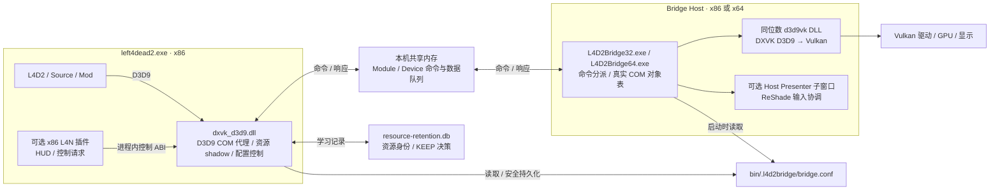
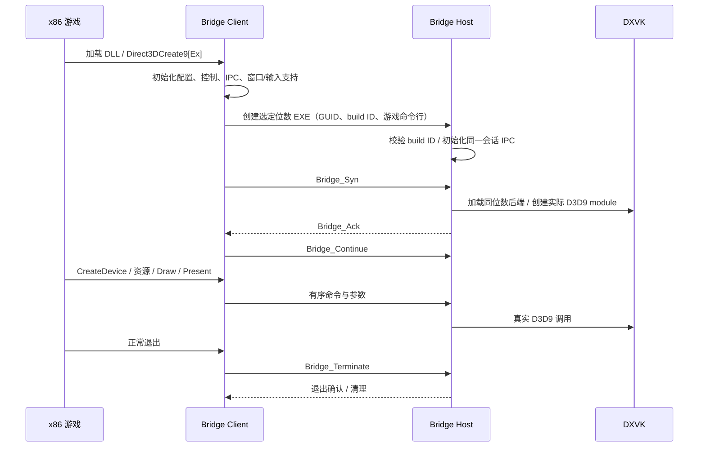
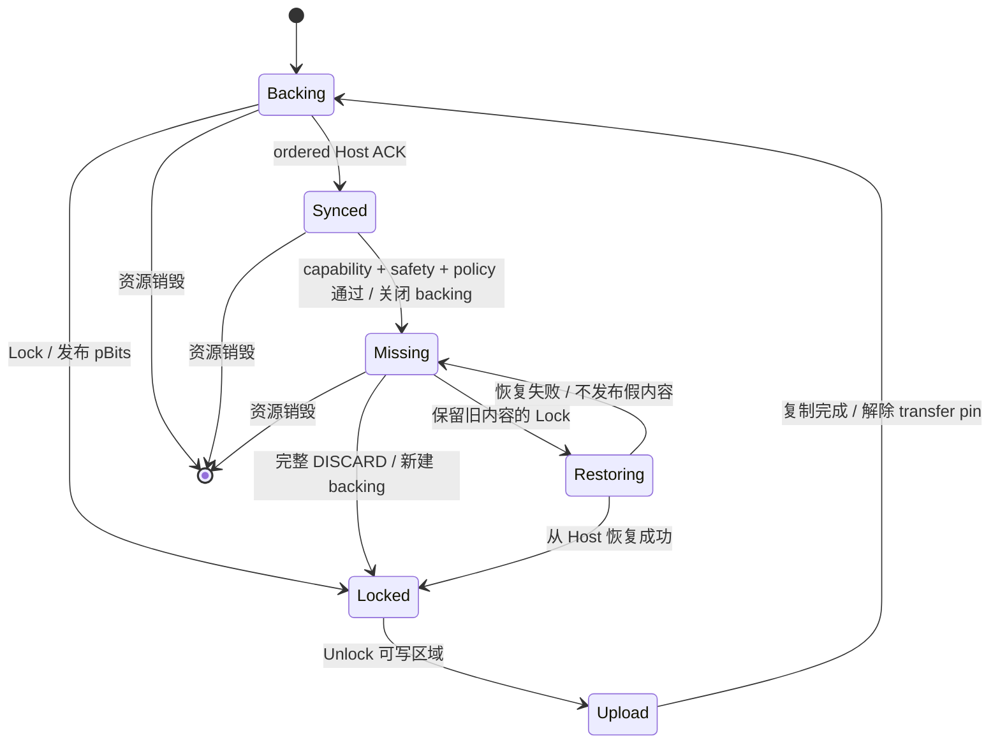
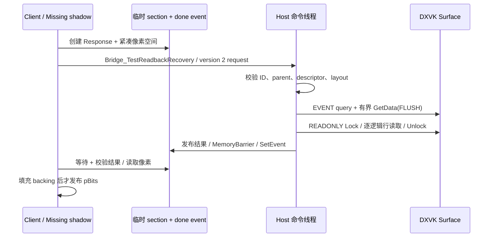

<!-- SPDX-License-Identifier: MIT -->
<!-- Copyright (c) 2026 yeyunyyds. -->
<!-- All newly added implementation code in this fork was generated by OpenAI Codex from prompts and specifications provided by yeyunyyds. -->

# 当前 Bridge 技术架构

本页描述 main 的 v1.2.0 正式版，Bridge 构建标识为 `l4d2-1.2.0+b5a6e83f77e1549f`。版本整合 Volume pitch、Reset、通用控制与默认关闭的 [数据/资源追踪](DATA-TRACKING.md) 和缓冲契约诊断。正式发布未另改渲染、回收或控制 ABI 语义。旧 `v1.2.0-dev.1` 附件不含全部后续更新，原实机记录保留各自 build 标识。

接口字段、调用示例和错误处理见 [API 参考](API.md)；安装与用户配置见 [README](../README.md) 和 [配置参考](CONFIGURATION.md)。本页的“服务器 / Server / Host”均指本机渲染进程，和 L4D2 联机服务器没有关系。

## 1. 系统组成与职责



| 组件 | 负责什么 | 不拥有的职责 |
|---|---|---|
| x86 Client | 实现游戏可见 D3D9 接口；代理对象、Client 状态缓存、上传 shadow、IPC；创建 Host；配置与控制 API | 不把 Source 引擎改成 64 位，不改游戏私有对象、贴花任务或联机逻辑 |
| x86 / x64 Host | 解码命令、管理真实 D3D9 对象、调用后端、呈现、有限资源 readback | 不替 Client 决定下次 Host 位数，不负责常用设置菜单写配置 |
| DXVK DLL | D3D9 后端语义、Vulkan 资源与提交、驱动交互 | Client PageBlock 回收不等于 DXVK 分配器或 VRAM 回收 |
| 可选 L4N 插件 | HUD、查询与控制请求、展示结果 | 不解析或编辑 `bridge.conf`，不加载第二份 D3D9 runtime |
| ReShade | 在 Host 的 Vulkan 路径处理其效果和 UI | Bridge 菜单不安装、卸载或重载 ReShade |

默认采用官方 DXVK 路径：`server.useVanillaDxvk=True`、`exposeRemixApi=False`。上游 Remix 接口和相关代码仍保留，但本分支日常路径不以 RTX/Remix runtime 为前提，也没有 GPU 厂商白名单。

## 2. 源码布局与构建关系

此仓库保存 fork 的构建脚本、配置、测试、插件和 `patches/l4d2-bridge.patch`。`scripts/prepare_bridge.py` 准备固定上游提交 `9aa74f8dfad2188efbd0f717c64d9f8fa909787e` 并应用补丁，形成可构建源码树。下表 `bridge/src/...` 路径指应用补丁后的上游树，不能直接在本仓库根目录查找这些文件。

| 源码区域 | 主要实现 |
|---|---|
| `bridge/src/client/d3d9_lss.cpp` | DLL 初始化、D3D9 导出、Host 创建与握手、退出 |
| `bridge/src/client/d3d9_module.cpp`、`d3d9_device.cpp` | D3D9 module/device 代理、状态缓存、创建/呈现/Reset/命令封装 |
| `bridge/src/client/base.h`、`shadow_map.h`、`shadow_lifetime.h` | Client 对象 ID、代理查找、父子对象与引用计数 |
| `d3d9_surface.cpp`、`d3d9_texture.cpp`、`d3d9_cubetexture.cpp` | 2D/Surface/Cube 锁定、上传、资源代理 |
| `d3d9_volume.cpp`、`d3d9_volumetexture.cpp`、`util/volume_layout.h` | Volume/3D 纹理锁定、字节 pitch 与逐行逐 slice 上传 |
| `client/lockable_buffer.h` | VB/IB 锁定和动态 buffer shadow |
| `client/pagefile_shadow.h` | pagefile section、映射视图、pin、视图预算与真正 backing 释放 |
| `client/pageblock_capability.h`、`pageblock_residency.h`、`pageblock_runtime.h` | capability、安全门、GC、覆盖统计与运行时集成 |
| `client/retention_*.h`、`readback_recovery.h` | learned identity、KEEP DB、恢复与学习 |
| `client/pageblock_control.cpp`、`bridge_control.cpp`、`bridge_settings.h` | 公共进程内控制 ABI 与配置目标管理 |
| `server/main.cpp`、`module_processing.cpp` | Device/Module 队列消费者、真实 D3D9 对象、Host 生命周期 |
| `server/readback_backend.h`、`util/readback_*.h` | Host readback、临时 section/event、布局和数据校验 |
| `server/overlay_presenter.h`、`client/window.cpp`、`di_hook.cpp` | 可选 Presenter、窗口消息和输入协调 |
| `util/util_bridgecommand.*`、`util_commands.h`、`util_ipcchannel.h` | 命令编号、协议头、命令批次、共享队列与响应匹配 |
| `util/config/config.*`、`config_document.h` | 配置加载、运行时缓存、保留原文的安全更新 |
| `plugins/l4n/L4D2BridgePlugin.cpp` | 独立 x86 L4N HUD 插件 |

Client、x86 Host、x64 Host 使用同一补丁生成相同的 Bridge build ID。启动握手要求同批构建；内部命令枚举和序列化不是跨版本通用协议。插件的控制 ABI 有单独版本和旧版 fallback，不要求与内部 IPC 的命令编号绑定。

## 3. 安装与位数

```text
<L4D2>/
├─ left4dead2.exe                         x86 游戏
└─ bin/
   ├─ dxvk_d3d9.dll                      x86 Bridge Client
   ├─ .l4d2bridge/
   │  ├─ bridge.conf
   │  ├─ L4D2Bridge32.exe                x86 Host
   │  ├─ L4D2Bridge64.exe                x64 Host
   │  ├─ d3d9vk_x86.dll                  x86 DXVK
   │  ├─ d3d9vk_x64.dll                  x64 DXVK
   │  └─ resource-retention.db
   └─ neko/plugins/L4D2BridgePlugin.dll   可选 x86 插件
```

游戏通过 `-vulkan` 加载其 `bin/dxvk_d3d9.dll` 路径，该 DLL 实际提供 D3D9 Client 接口。桥不需要对游戏私有渲染代码做补丁。完整包参考后端为官方 DXVK 2.6.1；用户替换同位数后端不等于修改 Client DLL。

当前随包默认是 x86 Host。两个模式均设置 `forceX64Server=True`，它在现有实现中还决定使用标准 runtime 目录；实际 EXE 选择由 `client.testX86Server` 决定：True 为 x86，False 为 x64。缺少该键时源码 fallback 是 x64，不能把随包值和源码缺省值混为一谈。

游戏地址空间始终属于 x86。x64 Host 只扩大渲染进程的地址空间；x86 LAA Host 在 64 位 Windows 上仍受约 4 GiB 用户 VA 上限及碎片影响。Host 与 Client 都有独立工作集和 committed memory，不能相加后称为“游戏引擎内存”。

## 4. 启动、线程与退出



DLL attach 初始化 Client 环境；目标进程首次进入 `LssDirect3DCreate9` / `LssDirect3DCreate9Ex` 路径时调用 `InitServer`。创建由 mutex 保护，同一会话共享已启动 Host，不为每个 Device 创建另一个 Host。Client 将 session GUID、Bridge build ID 等传给 Host；Host 在初始化通道前核对编译时版本标识。

Client 初始化通用设置管理器时保存启动配置快照。Host 启动后，Client 对真实进程句柄调用 `IsWow64Process2` 记录实际位数；检测失败时控制 API 返回 Unknown。ACK 的线程信息用于窗口消息通道，不能拿它充当位数判断。

| 执行位置 | 工作 |
|---|---|
| 游戏调用 D3D9 的线程 | 代理调用、缓存、shadow 锁定/上传、需要时等待结果 |
| Client 控制调用者线程 | Stats、策略、GC 或配置写入；这些都是同步调用 |
| Host 主命令线程 | 消费 Device 队列、执行渲染/资源命令和 readback 请求 |
| Host Module 工作线程 | 消费 Module 队列，执行 module/adapter 类调用 |
| Host MessageChannel 工作线程 | GetMessage/PostThreadMessage 低频窗口与输入消息；与 D3D9 共享内存队列分开 |
| 可选 Host Presenter 工作线程 | 创建 Host 所有的子窗口、消息循环、输入捕获协调 |
| Windows 注册的进程退出回调 | Client 观察 Host 退出，Host 观察 Client 退出；不等于故障后自动重连 |
| DXVK / 驱动内部线程 | 后端编译、提交等；由后端实现决定 |

顺序保障来自各队列和各自响应；Module 与 Device 不自动构成一个统一全局序列。队列内单写者行为通过 Client 命令封装的锁协调。控制侧还用 mutex/递归 mutex 与上传、销毁、恢复互斥。

正常退出发送终止命令、做有界等待、解除 hook 并输出/关闭日志。Host 停止 Presenter、退出命令线程并注销进程退出等待；当前保留不在结束阶段主动 FreeLibrary 后端的处理，由进程退出释放模块，以免引入后端依赖/线程卸载死锁。异常中断、外部杀进程和 Host 故障不等价于正常退出。当前没有 Host 热切换、自动重连或把既有资源搬到新 Host 的架构。

## 5. D3D9 代理对象与状态

游戏拿到的 `IDirect3D9[Ex]`、`IDirect3DDevice9[Ex]`、纹理、Surface、VB/IB、shader、query、state block 等都是 Client 代理。真实 COM 对象位于 Host，并进一步由 DXVK 管理后端状态。Client 对象由本地 factory 分配 ID；IPC 使用 32 位资源 ID，而不是把 Client 指针传给 x64 Host 解引用。

Client 的 shadow map 建立 ID → 代理对象映射；Host 的资源表建立 ID → 真实 COM 对象映射，Volume 还有对应表。纹理 mip、Cube face、Volume level 和隐式 swapchain surface 有父子/别名关系，获取 level/face 时登记其对应关系。

`D3DRefCounted` 区分公开 COM 引用和内部对象引用，并以原子状态管理。公开引用归零时，缓存、父子关系或其他内部引用仍可能让 wrapper 存活。因此不能用一次 `Release()` 或某个 AddRef/Release 日志推断真实 GPU 资源立刻释放，也不能要求每一次 Client AddRef 都一对一 RPC 到 Host。

Client 缓存部分 descriptor、绑定与设备状态，减少跨进程 getter；其他 getter 向 Host 请求结果。大量 setter/draw 是异步发送。默认并不发送全部后端返回值：创建与必要查询等待响应，普通异步调用的 Client `S_OK` 不代表 GPU 已完成或 Host 的每一次调用都成功。状态缓存也不构成任意故障后的完整资源/Device 重建系统。

## 6. IPC：命令、数据与响应

### 6.1 通道

使用 Windows 命名共享内存和同步对象，不使用 TCP、JSON 或跨机器 RPC。`ModuleBridge` 与 `DeviceBridge` 各有 Client→Host、Host→Client 两个方向，共四个 `IpcChannel`。每个 channel 包含命令 ring、数据 ring 和共享位置/回绕控制信息。

当前配置 Device Client→Host 通道为 96 MiB；Host→Client 缺省 32 MiB；Module 每方向缺省 4 MiB。通道内部还要容纳命令与控制结构，因此配置容量不能全部视为单个 payload 空间。该值不是 VRAM 或 PageBlock cache 上限。

窗口/输入另有低频 `MessageChannel`，用 Windows GetMessage/PostThreadMessage 和注册消息连接 Client 窗口侧与 Host 工作线程；该 channel 不传纹理 payload。恢复临时 section/event 又是另一条响应路径，见第 12 节。控制 API 本身是游戏进程内普通函数调用，不经过 HUD 专属跨进程通道。

### 6.2 发出一条命令

Client 创建 RAII command 对象，锁定发送 channel 并开始数据批次；首先写入一个 UINT32 UID，随后按双方约定顺序写入参数。标量、数组和带长度的 blob 写入 DWORD 数据队列，blob 做相应对齐。析构结束批次后才发布命令头并解锁，确保消费者先看到完整 payload。

协议头共 12 字节：`command:uint16`、`flags:uint16`、`dataOffset:uint32`、`pHandle:uint32`。`dataOffset` 是本次 payload 写完后的数据队列位置，用于校验/同步读写位置；不是资源内容偏移或进程指针。`pHandle` 通常是资源 ID，但 handshake、response 等命令有各自含义。

Host 消费命令头、先读取 UID，再进入相应 switch 分支读取参数、查找对象并调用真实 D3D9。需要响应时以 `Bridge_Response` 返回，头中的 `pHandle` 标记原请求 UID。Client 按命令及 UID 等待响应，不能随意丢弃不匹配的响应来“疏通队列”。

### 6.3 跨位数与同步边界

数据单元固定为 uint32。HWND、带指针 D3D9 参数与部分结构使用序列化/转换，不能直接把 x86 native struct memcpy 后当成 x64 native struct。adapter identifier 对齐差异已有专门解码；D3DCAPS9 按其布局传输，保留真实后端 Shader 能力。

命令顺序、Host 已消费上传、GPU 已完成三种状态不同：

1. 命令已发布：参数在共享队列可见。
2. ordered Host ACK：Host 已执行 ACK 之前的相关命令，可释放 Client 不再被引用的上传副本。
3. readback EVENT query 完成：恢复读取路径所需的后端同步已经完成。

普通 Host ACK 不意味着整张 GPU 空闲；Force GC 也不等于强制结束游戏仍持有的 Lock。

命令队列已有事件唤醒与 timeout/retry。当前连续过图无响应调查指出的 overwrite 等待竞态及 `syncDataQueue` 超时后继续执行风险尚未按 [计划](MAP-TRANSITION-QUEUE-FIX-PLAN.md) 修复；不能把现有 timeout 描述成所有失败都能安全终止和重连。

## 7. 资源上传与 Volume 字节布局

典型 2D 纹理上传：游戏 Lock 得到 Client 内存，写入像素；Unlock 把指定 rect 的逻辑行复制到 IPC blob；Host Lock 真实资源并按 Host pitch 写入，再 Unlock。游戏指针不会直接成为 Host 可用指针。压缩格式按 block 计算存储、边缘尺寸与行数。

ATI1/ATI2 的 D3D9 API 兼容布局和 BC4/BC5 实际 block 存储分别处理，避免把像素 pitch 与压缩 block bytes 混用。回收/恢复和上传需要共享一致的布局判断。

Volume（3D texture）当前使用 Lock 生命周期内的 Client CPU buffer。`D3DLOCKED_BOX.RowPitch` 与 `SlicePitch` 都是**字节数**：

```text
columns    = ceil(width / blockSize)
rows       = ceil(height / blockSize)
rowBytes   = columns × blockBytes
sliceBytes = rowBytes × rows
bytes      = sliceBytes × depth
row address = pBits + z × SlicePitch + y × RowPitch
```

Unlock 逐 slice、逐行复制完整 `rowBytes`，Host 再用自身 pitch 解包。wire 四字段仍为 `blockBytes / columns / rows / depth`，没有因为修 pitch 换一套协议。只读 Lock 不发送上传。布局 helper 检查范围、整数溢出和 pitch 容量。

此修复纠正了调用者看到的 stride 和上传字节长度，未添加 Volume 的内容 readback、PageBlock reclaim 或全生命周期优化。联机偏色报告用户已确认当前 x86 Host 版本解决问题，验证详情见 [Volume 修复](VOLUME-PITCH-FIX.md)。

## 8. 内存所有权：四个不能混淆的层次

| 层次 | 内容 | 释放或缩减机制 |
|---|---|---|
| 游戏/Mod 内存 | Source 数据、模型、音频、游戏自行保留的 CPU 内容 | 游戏原有生命周期 |
| Bridge 代理与传输 | Client wrapper、状态缓存、IPC、Host 对象表 | 引用计数、队列消费、会话退出 |
| Client PageBlock shadow | CPU 可锁定资源的额外副本：section backing 与映射 view | view LRU、learned/drop/GC 与按需恢复 |
| DXVK/驱动资源 | 后端 CPU backing、Vulkan image/buffer、分配块、shader cache | 后端资源生命周期和分配器 |

`PagefileShadow` 以 `CreateFileMapping(INVALID_HANDLE_VALUE, ...)` 创建匿名 pagefile-backed section。section 是 backing；`MapViewOfFile` 得到游戏进程中的映射 VA。二者生命周期独立：

- **只 unmap view**：Client mapped VA 减少，section backing 仍存在，重新映射即可读原内容。
- **真正 evict backing**：unmap view 并关闭 section，标记内容缺失；下次需要保留旧内容时必须恢复。
- **destroy resource**：注销 tracking 和对象关系、释放剩余 shadow 与真实对象引用。

view cache 默认预算为 128 MiB，只限制 Client 映射视图，不能单独限制全部 backing。PageBlock 是资源 shadow/子资源 tracking entry，不是每一个 4 KiB OS 页。backing bytes 是逻辑大小，mapped bytes 反映映射占用；二者都不能直接当成 resident working set。GC 累计释放字节也不代表同一时刻节省了这么多 RAM。

## 9. PageBlock 回收状态机



这是关键状态的示意，实际实现还记录完整上传、学习分类、保护计数和失败状态。判断分为三层：

1. **Capability**：此资源类型、format/layout、pool/usage、尺寸与 backend 是否支持恢复。
2. **Safety**：backing 是否存在；游戏是否持有公开 Lock 指针；传输是否被 pin；是否完整上传且已得到有序 ACK；参考测试是否关闭。
3. **Policy**：learned GC 是否要求已学习且允许回收，还是 aggressive/drop 忽略 KEEP 分类。

capable 大不意味着 safeNow 大；Stats 中 `safeNow=0` 也不直接意味着 AGC 无法回收，因为 Stats 不暗中获取 ACK，GC 可以为待同步资源请求 ACK。没有 backing 的 entry 仍可被跟踪、计为 capable，但本轮没东西可释放。

entry 表是受 context mutex 保护的非拥有关系。回收和上传/销毁通过同一安全门协调；公开 pBits 和 transfer pin 还在底层物理保护 backing。相关嵌套锁次序为 residency context → learned context → PagefileShadow。Force 只允许 drain 已知桥所有的操作，不主动替游戏 Unlock。

## 10. 策略、GC 与学习 DB

| 行为 | 语义 |
|---|---|
| runtime `keep` | 不自动淘汰；显式 Aggressive/Force GC 仍可处理支持且安全的资源 |
| runtime `learned-aggressive` | 沿 learned identity/KEEP 规则处理符合条件的静态纹理 |
| runtime `drop` | 实验性：eligible entry 空闲时走 aggressive reclaim，可能增加后续恢复停顿 |
| GC Learned | 尊重 learned KEEP、分类和 learned recovery 覆盖 |
| GC Aggressive | 忽略 learned KEEP/未分类限制，仍保留 capability、Lock、transfer、完整上传与 ACK 安全门 |
| GC Force | aggressive 加桥已知的 drain/wait，仍不越过游戏 Lock 和不支持的恢复类型 |

SetPolicy 改变当前策略，不等于立刻全量扫一遍，也不会立刻恢复已丢弃的 backing。GC 不改变策略值。L4N 的策略选择只改 runtime；`save to configure` 才保存下次启动目标。

learned identity 的覆盖比通用 aggressive residency 窄：MANAGED、Usage=0 的 2D 纹理，1–15 个 mip，DXT1、DXT5、A8R8G8B8、X8R8G8B8，满足调用点和完整初始上传等条件。身份由归一化调用模块/RVA、资源 descriptor、各 mip 内容摘要形成。DB 保存身份与 KEEP 决策，**不保存纹理像素**，因此不是 recovery 内容仓库。

learned 路径在初始内容淘汰后发生需要旧内容的 Lock 时，读取 Host 内容并用保存的摘要校验，成功后学习为 KEEP。generic aggressive/drop recovery 按 Host 当前内容恢复，不把游戏之后合法改变的内容强行比对初始摘要。DB 缺失/错误走保守规则，不能把所有 entry 的 unclassified 等同于恢复缺口。

参考 readback test 会保留原始副本，并用独立临时数据校验实验结果；它阻止真实 reclaim，控制 SetPolicy 也可能因此返回 E_ACCESSDENIED。测试成功和生产环境“丢掉副本再恢复”是两种不同证据。

## 11. 当前恢复覆盖与访问入口

通用 capability 要求当前 pagefile shadow/vanilla DXVK 路径、非 backbuffer、Usage=0、非多采样、非 DEFAULT pool、已知且尺寸匹配的布局，并满足单资源最多 64 MiB、宽高最多 16384 等限制。支持适用的 2D mip、Cube face、独立 Surface 及 SYSTEMMEM/SCRATCH offscreen surface；具体 format 集合见 API 的内部 recovery 参考。

恢复门位于 Surface 锁定路径，在向游戏返回 `pBits` 前执行。全范围 DISCARD 可直接建立新 backing；READONLY、非 DISCARD 或需要保留未覆盖部分的写入必须先取回内容。GetDC 等经 Surface LockRect 的访问共享该入口；getter 得到 wrapper 本身不是 CPU 数据读取。已有 copy/更新/readback helper 还要按具体 D3D9 路径处理，不能据此声称任意 CPU/GPU 访问都已统一支持。

| 资源/路径 | 当前边界 |
|---|---|
| eligible 2D / Cube / Surface | PageBlock backing 回收 + 按需恢复已实现；格式和 descriptor 有明确限制 |
| backbuffer / RT / depth-stencil / DEFAULT / 多采样 | 可有代理与统计，不进入上述 generic reclaim/recovery |
| Volume texture | LockBox/UnlockBox 上传已修；没有通用内容恢复或 PageBlock 回收 |
| VB/IB | 有锁定、shadow、传输与普通引用生命周期；没有本次 PageBlock GC 或新增完整生命周期优化 |
| shader / state block / query 等 | 普通 D3D9 代理对象路径；不属于像素 shadow recovery |

“原版 L4D2 能通过 DXVK 工作”说明后端能支持相应 D3D9 调用，不能推导“桥可以任意删除所有 CPU 副本并在任意访问时恢复”。原版 DXVK 没有额外跨进程代理，且其资源类型、可锁定规则与内存所有权不同。桥需要逐项具备身份关联、同步、格式布局、访问入口及错误传播；目前部分资源选择保留而非淘汰。`recovery gap=0` 仅说明当次跟踪集合通过现有分类，没有证明所有 D3D9 资源、所有设备或将来访问全覆盖。

## 12. 恢复的跨进程交换

普通队列负责把 recovery 请求排到正确位置，但内容和完成结果通过一次性命名 section + event 返回。当前内部 wire version=2，Request 240 字节、Response 88 字节；名称以 `Local\L4D2Recovery-` 开头，包含进程/序号/时间信息，冲突时拒绝复用。



该命令名称含 Test，但当前也承载生产 learned/generic ACK 和恢复。operation=1/3 是 ordered ACK，验证资源并确认前序命令已处理，不读取像素、不执行上述 GPU query。operation=0/2 才执行内容读取；Host query 等待上限 5 秒，Client 临时交换等待 20 秒。恢复失败不以零填充伪造旧像素。

临时响应隔离避免恢复超时后迟到的普通 `Bridge_Response` 混入后续响应匹配。它不让整个 IPC 成为可自动重连协议。Managed 的 READONLY Lock 可能从 DXVK 自身 CPU backing 读取，不能宣称每次都从 Vulkan image 下载；query 同步也不等于无条件 device-wide idle。

## 13. Present、Reset 与可选 Presenter

默认 backend 以游戏 HWND 呈现。`client.forceWindowed=True` 可让后端按窗口参数运行，即使游戏 UI 执行其“全屏”模式切换，仍不能把 UI 选项和真实 Vulkan exclusive fullscreen 等同。窗口句柄及 presentation 参数跨位数转换，Client/Host 分别管理自己的对象。

Reset 路径处理真实 backend Reset、隐式 surface/swapchain 引用和重新获取资源。当前修复平衡获取时的临时 COM 引用、解除旧隐式对象关系，并仅在成功路径提交 Client 新状态。作者已确认当前 x86 常用配置下窗口→全屏→窗口正常；其他 backend、Presenter 和显示设置组合仍需验证。详见 [Reset 说明](FULLSCREEN-WINDOW-RESET.md)。

启用 Presenter 后，Host 的专用线程创建一个附属于游戏 HWND、但所有者是 Host 的可见子窗口，维护尺寸和消息循环；实际 presentation 路由到它。它解决 x64 ReShade 不在 x86 游戏进程中、无法直接拥有游戏窗口输入的边界问题。

输入支持由 Host 受控 keyboard hook、窗口消息和 Client 消息泵/DirectInput 转发策略协作。ReShade 6.0.1 公开 addon API 的 overlay 开关事件触发 capture 状态，面板开启时抑制/协调游戏输入，关闭时释放；热键 fallback 默认关闭。已验证组合为 x64 Host + Vulkan ReShade 6.0.1。Steam Overlay 实验代码和诊断存在，但完整 Shift+Tab UI/输入仍不是已验证支持。

Host/Presenter 设置修改只更新配置；本会话不销毁/重建 Presenter，不 Reset Device，不杀 Host、不换位数、不重载 ReShade。

<a id="configuration-persistence"></a>

## 14. 配置所有权与安全持久化

`Config::init` 在各进程启动时读取配置并构造其内存快照。Client 从实际加载 DLL 的目录和已有 runtime 路径规则定位 `bin/.l4d2bridge/bridge.conf`，不会让插件自行拼游戏路径。Host 读取自身启动配置。通用设置的磁盘查询重新读文件，不修改已初始化的全局 Config 缓存。

控制 API 只支持指定常用设置，不提供任意 key 写入：

- Memory Policy：先 runtime SetPolicy，再安全持久化；两个结果独立，失败时不伪装为一个事务。
- Host：写 `forceX64Server=True` 和 `client.testX86Server=True/False`，下次完整启动生效。
- ReShade Presenter：Enable 写配套九项；Disable 只关闭三项核心开关，保留其他用户设置。

编辑器保留原始字节文本、注释、空行、未知 key 和顺序，支持 UTF-8 BOM、LF/CRLF。目标 key 更新第一个有效定义，重复有效定义转成注释；缺少时追加。不使用会排序重写全部配置的旧保存函数。它不是编码转换器：写侧明确拒绝 UTF-16 BOM，读取上限为 16 MiB；配置目标查询另会拒绝嵌入 NUL。不能把这些局部检查描述成全面编码校验。

写入使用同目录 `bridge.conf.tmp`、CREATE_NEW、完整写入、FlushFileBuffers、CloseHandle，再核对原文件未被外部更改，最后 MoveFileExW 原子替换。写失败保留原配置并清理本次创建的 tmp；已有 tmp 不覆盖、不删除。外部修改被检测时返回 ERROR_RETRY。最后比较和替换之间仍有小的外部写入竞争窗口；它不是多进程数据库事务。

Restart Required 比较实际 Host 与磁盘 Host 目标（实际 Unknown 时不做该项比较），以及 Presenter 九项启动快照与当前配置。只比较 presenterWindow 会漏掉输入配套设置改变。Memory Policy runtime/config 差异本身不产生 restart 标记。读配置失败时 restartRequired 的零值不能作为“不需要重启”的证据。

## 15. 控制层和最终 L4N 菜单

公共 `L4D2BridgePageBlockControl` 保留 ABI v1/v2，提供 Stats、runtime SetPolicy、GC。新增 `L4D2BridgeControl` 的独立 ABI v1 提供设置目标、持久化和汇总状态。两者都由游戏中的 Client 导出，通过 stdcall 同步调用；与内部 IPC protocol version 不同。

L4N SDK v2 以 KeyValues 菜单文本、callback 地址和 opaque user_data 连接 HUD。插件枚举当前进程已加载模块，以 GetProcAddress 找控制导出，不 LoadLibrary 第二份 D3D9。旧 Bridge 缺少通用 API 时，PageBlock、runtime 策略和 GC 继续工作，保存/Host/Presenter 显示不可用。PageBlock v2 被 E_INVALIDARG 拒绝时才回退 v1。

```text
L4D2 Bridge
├─ Status                         仅 PageBlock，重新进入重新查询
├─ GC
│  ├─ Learned
│  ├─ Aggressive
│  └─ Force
├─ Memory Policy
│  ├─ 当前策略: keep / lg / drop (configure 或 runtime)
│  ├─ keep                        只改 runtime
│  ├─ lg                          只改 runtime
│  ├─ drop [experimental]         只改 runtime
│  └─ save to configure           查询当前 runtime 后确认保存
├─ ReShade Presenter
│  ├─ Enable                      保存，下次完整启动
│  └─ Disable                     保存，下次完整启动
└─ Host
   ├─ Configured Host: x86 / x64
   ├─ x86 Host                    暂存选择
   ├─ x64 Host                    暂存选择
   └─ Save                        保存，下次完整启动
```

策略 runtime/config 相同时标 configure，不同时显示当前 runtime。Host 菜单不展示实际 Host，Status 不展示 Host/Presenter/重启状态，但控制 ABI 保留这些字段供其他客户端使用。插件不添加手写 Back，说明文本 callback 返回 nullptr；`Last action result` 表示上次动作而非实时状态。菜单不暴露测试或诊断项。

## 16. 诊断、性能与故障边界

| 诊断层 | 观察对象 |
|---|---|
| `bridge32.log` / `bridge-host32.log` / `bridge64.log` | 会话、后端、控制与一般错误 |
| `l4d2-memory.log`、Host memory | 工作集、commit、VA、资源/分配观察 |
| PageBlock / retention / GC | 锁定、分类、回收、ACK、恢复与学习 |
| color Client/Host | sampler/render-state/texture/Volume 的两侧记录和采样摘要 |
| API wait | 创建、队列、响应、Reset、资源恢复等等待成本 |
| exception | 故障模块/地址与可选详细 stack/context |
| Presenter / Steam input | 窗口激活、capture、公开 overlay 事件与实验输入 |

这些日志是定位桥的问题的证据。当前源码的 [诊断分离](RUNTIME-DIAGNOSTICS-SEPARATION.md) 将 memory 与 crash history 改为默认关闭的独立子系统；关闭不扫描、不更新历史/诊断统计、不创建可选线程或文件。PageBlock residency/reclaim、实际策略、恢复、Reset 和 IPC 同步始终保留；固定存储/空 token/廉价启用检查仍编译在二进制中。已发布 v1.2.0 基线的行为见实现前审计。启用逐调用日志、hash 或参考 readback 会增加 CPU、I/O、等待与额外内存，不能用诊断开启时性能代表日常默认配置。

当前已确认的场景包括作者 x86 Reset 往返、反馈用户 x86 联机偏色消失、实际 AGC/FGC backing 释放和部分 2D 恢复。自动测试覆盖 ABI、菜单、配置、布局、回收门及 mock 恢复；它们不能替代真实 L4D2、GPU、L4N、ReShade 和 Mod 组合。

仍需调查/验证：连续过图队列无响应、个别进图加载崩溃、游戏模块崩溃报告、drop 停顿、更多格式/资源类型的实际恢复，以及 L4N 保存与重启后的真实 HUD 行为。VB/IB、Volume、RT/depth 等全量恢复和 Host 重连未实现。配置菜单与 pitch 修复没有改变这些边界，也没有对 Source/studiorender 做修补。

## 17. 维护时的接口选择

扩展 HUD 或其他游戏内控制器时，使用公共 control ABI；扩展 D3D9 代理时，同时核对 Client 序列化与 Host 解码；扩展恢复类型时，同时补齐 capability、布局、身份关联、同步、访问入口和失败传播。禁止只把 recovery gap 计数改为零就声称恢复已覆盖。

维护依据按层查阅：[API](API.md)、[L4N 设置](L4N-BRIDGE-CONTROLS.md)、[PageBlock/GC](PAGEBLOCK-DROP-GC.md)、[readback](READBACK-RECOVERY-EXPERIMENT.md)、[配置](CONFIGURATION.md)、[自动与实机测试](TESTING.md)、[累计变化与验证边界](CHANGES-SINCE-V1.1.md)。
