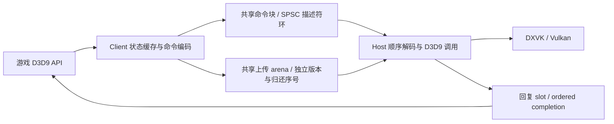

<!-- SPDX-License-Identifier: MIT -->
<!-- Copyright (c) 2026 yeyunyyds. -->
<!-- All newly added implementation code in this fork was generated by OpenAI Codex from prompts and specifications provided by yeyunyyds. -->

# IPC 效率优先架构评估

评估日期：2026-10-10。评估分支：`codex/ipc-efficiency-architecture`，从 main `cf49175e8a3c6c2fe45c99aec0680b0d1c864d24` 建立。本次产出架构方案，不修改生产 IPC、不发布二进制。

**结论：有明显的结构性优化空间，值得重构；主要收益来自减少跨进程共享状态更新、合并命令、调整上传所有权与减少同步往返。忽略安全防护并不是获得这些收益的必要条件，也不足以单独带来大量优化。尚无新架构的 Windows/游戏性能证据，不能承诺 FPS 或确定的吞吐提升。**

## 1. 代码与证据基线

仓库保存构建、配置、插件、测试和累计补丁，完整生产 Bridge 来自固定 NVIDIA 上游 `9aa74f8dfad2188efbd0f717c64d9f8fa909787e` 加补丁。只阅读仓库根目录不能完成 IPC 调查。

此次展开了 main 和 [PR6](https://github.com/yeyunyyds/L4D2_Dxvk_32to64_Bridge/pull/6) 两套源码，沿 Client COM API、状态/引用计数、资源 Lock/Unlock、序列化、四向 IPC、Host 分派、回复、PageBlock/Retention、Readback、Present/Reset/退出追踪。也检查构建、默认配置、测试提取及 A/B 计时方法。全树清单记录每个文本文件的行数、哈希及 IPC 调用标记：项目 143 个文本文件；PR6 展开 Bridge 269 个文本文件，其中排除 Tracy 后 218 个。全树清单用于核对覆盖范围，不意味着逐行审计第三方 Tracy、DXVK/Vulkan 或整个 Remix 渲染器。

分析的 PR6 HEAD 为 `14fc5db13d4a9e637fc6b001d06ab5ca3f1eed11`，GitHub blob `54a928f325c6107056a9ea669271819729ea787a`；获取的累计补丁原始内容 SHA-256 为 `9c0f063939cd14fb3d6571880dfb1e27bdcd8649b746f1f1480c845f4b89e24c`。展开生产树相对 main 有 33 个文件变化，新增 1337 行、删除 735 行；这是应用补丁后统计，不是 PR 页面文件统计。

**PR 报告里的性能结果属于 `086ab720`，不是当前 HEAD。** 当前 HEAD 已继续加入已知 Packet 整包预留/读取、reservation 复用、缓存 published frontier、Command 本地标记 relaxed、Header try_push、独立 translation unit 性能对照等优化；最新提交进一步合并 packet planner。旧报告不能证明当前 HEAD 仍精确退化 81.2%，也不能证明这些后续优化已消除退化。

Shell 的 Git fetch 因环境代理连接失败而不可用；PR 文件通过已有 GitHub Connector 获取，在 work/ 中展开，未覆盖其他研究 checkout。评估分支在本地，尚未推送。

## 2. PR6 到底在做什么

PR6 的主体是数据队列正确性和失败传播，后续叠加了局部性能优化。

1. 修复 Host 在 Client 登记等待之前已完成消费、双方漏掉对方操作导致 Client 仍等待的竞态。
2. 修复超时/系统等待失败后 serializer 继续写、RAII 析构继续发布 Header 的行为。
3. 统一 UID、字段、blob 长度、DWORD 对齐和环尾 padding 的空间计算；拒绝覆盖未消费数据。
4. 用共享原子单调游标追踪 reserved/published/consumed，并覆盖 Device/Module、请求/回复各方向。
5. handler 真正完成后再释放数据；optimized dynamic Lock 的跨命令指针另行 pin 到 Unlock/Destroy。
6. `finish()`/abort/poison 将失败传到创建、StateBlock、VB/IB、Surface/Volume、恢复及 Present；必要时返回 DEVICELOST。
7. 增加小环、跨位数、多线程、故障注入、所有权和性能对照。

这些约束中的“不覆盖、发布完整数据、正确唤醒、指针用完后释放”属于算法正确性。取消它们可能更快地写出错误帧或卡死，不能当成等价性能优化。可以按本地可信、同批 Client/Host 的假设简化协议校验、防御性日志及扩展兼容；本方案不以恶意对端隔离为设计目标。

## 3. 当前架构的实际成本

现有传输已经是本机共享内存，既没有 TCP，也没有 JSON。改为 socket、named pipe 或另一套通用 RPC 不会自动更快。

| 成本/现象 | 当前实现证据 | 重构机会 |
|---|---|---|
| 一个 API 一个 Command | `util_bridgecommand.cpp::Command/finish/~Command`；小字段 setter/draw 仍广泛使用 generic serializer | 多个命令共享一次发布/回收 |
| 命令环、数据环分别同步 | `finish()` 先 release published，再发布 Header；reader 检查 Header、published、数据边界 | 单一批次描述符作为可见性与所有权入口 |
| 跨进程缓存行竞争 | `data_ring_contract.h::Control` 的 published、consumed、waiting、fault 位于同一个 64-byte 控制块 | 按写入方拆分缓存行，正常进度与等待状态分离 |
| 每命令 SC 消费发布 | `end_read_data()` SC store consumed，再 SC load waiting | 成批释放 credit，环压力/空闲前补发 |
| 命令发布 SC | `AtomicCircularQueue::try_push` 的 SC producer index 及 waiting 检查 | 保留唤醒证明，按批次摊薄，而不是机械改成 relaxed |
| x86 64-bit 原子与 64-bit cursor 计算 | `Control`、reservation、published/consumed；最终机器指令取决于 MSVC/位数 | 固定 slot/block index 使用 32-bit sequence，减少热路径 64-bit 操作 |
| Client 多层加锁 | Device 锁与 channel Command mutex，默认 `threadSafetyPolicy=1` | 统一状态更新、顺序和编码锁边界；经验证后提供单 owner 路径 |
| 两次上传拷贝 | VB/IB：shadow→IPC，Host `memcpy`→backend Lock；Surface/Volume 逐行类似 | 独立共享上传 arena，适用资源直接写入可移交版本 |
| 长期指针阻塞整个数据环 | optimized Lock 的 `s_readPins` 限制最早 consumed | 上传块独立归还，长 Lock 不占命令环 |
| 状态流量 | `SetTexture/SetStreamSource/SetIndices/SetShaderConst`；部分已有同值过滤开关，更多只是诊断比较 | 扩展有效状态跟踪，合并 Draw 前覆盖的状态 |
| 回复队头匹配 | `waitForCommand` 遇到其他 UID 执行 `Sleep(peekTimeoutMS)` | reply slot 或单消费者分发，避免其他调用者卡住匹配 |
| 资源表访问 | Host 多个 `unordered_map<uint32_t, COM*>` | 后续改为分块稠密 handle 表，降低热分派查找成本 |
| 回收 ACK 的对象创建 | recovery operation 1/3 也创建 Temporary section/event | 普通 ordered completion seq 承载 ACK；大 readback 独立池 |

命令 ring 的两个 index 已按 128 bytes 隔开；不能把“所有 index 都存在伪共享”作为结论。主要新机会在数据 Control 和更细粒度的发布/消费模型。当前没有实际硬件计数器数据，缓存竞争和原子成本是代码支持的待测假设，不能把约 100 ns 全部归给其中一项。

## 4. 推荐架构：成批命令 + 独立上传 + 定位回复

Device 是性能主通道；Module 初期保留独立低频通道，复用编码/回复设施。窗口/输入 MessageChannel 保持低频消息传递，避免与渲染大 payload 耦合。外部 COM 接口和 x86 Client→x86/x64 Host 的目标保持。

### 4.1 命令块与一次发布

- 初始实验用 16 KiB/64 KiB 命令块或可变长块；尺寸由分布测量选择，不能固定每个 12-byte setter 独占 64 KiB。
- 块内紧凑记录：opcode、recordBytes、resource handle，以及固定宽度参数。异步命令不必各自携带独立 response UID；块含 completion sequence，需回复记录另含 reply token。
- 普通小命令直接编码到 producer 独占的未发布共享块；避免再引入“本地 staging→共享块”的整块复制。
- 完整块的范围一次预留；逐条记录只维护本地 offset。发布描述符保证此前写入可见，Host 按长度解码整个块；不再单独发布另一份 payload frontier。
- 生产端拥有自己的 index，消费端拥有自己的 index，各自缓存对方 credit；index、等待登记和低频 fault 分离布局。
- 首版保留已经证明的 SC 登记/重查唤醒逻辑，改为每批次执行；payload 的 release/acquire 可见性与唤醒协议是不同问题。任何弱化都必须单独给出内存模型证明及 Windows 跨进程测试。
- 如用 32-bit 环序号，采用模差值判定，限制最大未完成跨度小于半序号空间，测试 wrap/ABA；不能简单截断现有 uint64 cursor。handle generation 与 slot sequence 分别管理。
- 空间满时先发布本地已编码块，再等 credit；否则可能出现 Client 等空间、Host 等未发布命令的死锁。取消仍有界，失败仍返回受控错误。

消费 credit 可以按块归还；如果再聚合多个块，达到水位、writer 等待、队列空、同步请求及退出前必须归还。缓存 credit 只能保守少用空间，不能提前重用。

### 4.2 Flush 和线程顺序

第一版在 Draw 前发布当前状态/上传及该 Draw，在 Present、同步 getter/query、创建、Reset、Readback、ordered ACK、销毁/退出边界 flush。这样先摊薄多个 setter 的发布成本，又保留及时执行 Draw 的行为。之后才实验跨多个 Draw 聚合，阈值例如 16/32 个记录或块容量，比较吞吐与 p95/p99 延迟。

不能只在 Present flush：同步 getter 可能在 Present 前等待；游戏可能长时间不 Present；上传/创建/销毁也可能卡住。跨 Draw 批处理若需要严格时间上限，必须有能够及时 flush 的执行机制；单纯每 N 条才读时钟不能保证低调用量时的上限。额外提交线程和复制/交接成本纳入对照，第一版不强制增加线程。

默认仍遵守游戏所需的多线程 Device 契约。把状态修改与命令排序放进统一锁事务，异步编码与 flush 同序；同步等待释放生产锁，保留专属 reply slot。只在确认单线程调用且 API 契约允许时使用无锁单 owner 模式，不默认把线程安全强制关闭。每线程独立 ring 必须另做全局顺序合并，容易抵消收益，首版不采用。

### 4.3 独立上传 arena 和生命周期

命令只引用 `segmentId / allocationId / generation / offset / bytes / layout`。上传块独立于命令 credit，Host 完成使用后归还。通用后端依然要 Lock、memcpy、Unlock，所以这里只消除 IPC 中转拷贝，不能宣称 GPU 零拷贝。

| 资源 | 初始路径 | 必须解决的契约 |
|---|---|---|
| DYNAMIC + DISCARD VB/IB | Lock 返回新共享版本，Unlock 移交；Host 消费完归还 | 部分范围、offset、对齐、多锁、DISCARD 与 NOOVERWRITE 语义 |
| NOOVERWRITE | 版本/区间所有权跟踪，无法证明不重叠时退回快照 | 不能改写 Host 尚未复制的同一区域 |
| static / 非 DISCARD VB/IB | 保留完整 shadow；先用共享快照上传 | 应用只改 Lock 范围内部分字节时仍保留旧内容；重叠多 Lock |
| 2D/Cube/Surface | 后续按格式/layout 移交共享版本 | pitch、block、ATI、子资源别名、GC pin 和历史内容 |
| Volume | 单独验证后迁移 | RowPitch/SlicePitch 字节布局、逐行逐 slice、部分 box 与现有行为 |

把 static shadow 移到共享内存后，下一次 Lock 仍可能改写 Host 尚未处理的上传版本。可选方案是版本复制、区间快照或等待 prior upload consumed；选择由测量决定。简单“共享同一块内存并发写读”不是可用的架构。

当前 SharedHeap 已提供映射和 ID 路径，可复用经验，但 allocator 扫描、分段查找、Alloc/Dealloc RPC、元数据 SC 及寿命规则仍需重构。配置中开启现有 `useSharedHeap` 还会使 PageBlock runtime 支持门关闭，不等价于本方案。

上传 arena 优先按寿命/大小分池，避免巨大上传阻塞小块。x86 的 VA 与碎片仍是约束，使用分段/窗口映射与明确预算；不能无限增加常驻映射来换吞吐。Client 指针不跨进程直接解引用。

### 4.4 状态压缩

分两层实施：先扩展精确同值过滤，再合并没有观察点的连续 setter。

- binding 使用资源身份和全部有效参数；shader F/I 常量按位比较，BOOL 按既有归一化规则；维护 valid/dirty 标记。
- 普通 getter 仍读 Client 当前状态；Draw、Clear、copy、query、同步 getter/validation、StateBlock Capture/Apply、Reset 等观察点之前提交需要的状态。
- Begin/End StateBlock 录制有独立 dirty/capture 域；第一次 setter 即使等于 Device 当前值仍可能必须录入。首版录制期间不合并有疑义操作。
- 任何被推迟绑定的资源都由批次持有引用直到消费；否则 Client 切换 binding/Release 后可能先销毁 Host 资源。
- shader 常量合并成连续 dirty register range；每次合并的比较/扫描开销也测量，不能为少量常量扫描全表。
- Draw 本身保持顺序，不做无依据消除；`sendAllServerResponses=True` 的诊断语义不适用普通异步合并。

已有 `eliminateRedundantSetterCalls` 仅覆盖部分 setter且默认关闭，不应把该思路描述为完全从零新增。现有 dataDiagnostics 的同值比较只是证据采集，不会自动过滤。

### 4.5 回复、ACK 和大 Readback

同步调用申请 reply slot，记录 token 和 generation；Host 写结果后发布 completed sequence，等待者只读取自己的 slot。容量满也先 flush，再等待，不让某个 UID 的回复占住其他请求的队头。小回复不必都经过大数据 ring。

第一阶段可以保留现有 reply 通道并优化等待策略；slot 是第二阶段协议变更。等待事件可每等待者复用；不能用一个 auto-reset event 假设会唤醒正确的 UID 等待者。若使用共享事件，必须有对应分发/广播与重查证明。

ordered ACK 可由 Host 已处理的命令 sequence 满足，省去每次 recovery operation 1/3 创建命名 section/event。ACK 必须位于相关资源操作之后；上传内存也必须已不再被 handler 引用。ordered ACK 仍不代表 GPU 完成。

大 readback 使用独立共享结果池/slot；token generation 防止迟到结果写进新请求。超时 slot 在 Host 确认完成或会话结束前不能复用。保持原有 EVENT query/后端读取同步，避免迟到普通回复污染后续请求。

### 4.6 Host 解码与资源表

用单一 opcode schema 定义字段布局、长度和是否需回复，生成双方 codec，减少 generic `get_data` 与布局计算重复；外部 D3D9 COM 接口不变。先保留现有 switch handler，避免将大规模接口改写与传输实验混在一起。

后续将 hot resource map 替换为分块数组 + slot/generation，保留类型、别名和所有权。当前 ID 空间及重用规则需迁移，不能直接把任意 ID 当 vector 下标导致巨大稀疏分配。dense table、函数指针分派与大 switch 用实际 trace 比较，函数指针并不必然更快。

## 5. 收益大小能说到哪一步

已有报告的无竞争 64 B Client 为 122.3→221.2 ns/包，连续 64 B 为 241.2→343.6 ns/包；这是 `086ab720` 的 Windows 配对数据，最新 HEAD 待测。64 KiB 的相对增量约 1.5%，说明单包固定成本主要影响小命令，大 payload 则应关注拷贝与内存带宽。

如果每 32 条命令只做一次 publication，**该类 publication 次数**理论上减少 96.875%；每条记录编码、D3D9 handler、COM/DXVK 工作仍存在，因此不是整个 IPC 或帧时间降低 96.875%。状态压缩减少的是调用数量，不应与 batch 同步收益直接相加。

适用的直接共享 DISCARD 上传可从“shadow→IPC→backend”两次 CPU 拷贝变为“共享上传→backend”一次；仅指这一部分数据的传输拷贝量。static 快照、COW、纹理历史内容及后台读取会改变净收益。

测量成本模型：`T_bridge = N × (编码 + 锁 + 分派) + batch_count × 发布/归还 + bytes_copied / 带宽 + 同步往返 + 背压`。游戏帧时间取决于 Client/Host/GPU 关键路径；不能把双方线程耗时直接相加，也不能将 ns/包转换成 FPS。

举例：若某帧确有 10000 次可比小包提交，100 ns/包对应 Client 约 1 ms 的提交 wall 增量。这是条件计算，不是当前 L4D2 已测命令数。大幅 IPC 改善可能在 CPU 限制场景显著，在 GPU 限制场景接近无 FPS 收益。

## 6. 优先级与迁移顺序

| 阶段 | 具体交付 | 判定 |
|---|---|---|
| 0：冻结基线 | main、PR6 `086ab720`、PR6 `14fc5db1` 三套 Windows 同机对照；采集小包/上传/RPC分布 | 区分旧报告与最新 HEAD；确定热点占比 |
| 1：保留协议的快路径 | generic 小包转已知 packet、默认禁用诊断的编译路径评估、控制布局拆线实验 | 找出低成本收益，单项归因；不与后续批处理混淆 |
| 2：命令块 | 新 transport version；Device 批量描述符、一次预留、一次发布、块级消费；保留 SC 唤醒 | 同序字节/故障测试通过；小包吞吐和延迟同时比较 |
| 3：上传 arena | 先迁移 DISCARD VB/IB；长 Lock 独立 pin；static 保留 shadow fallback | 拷贝量、CPU、VA、峰值存储及 Lock/Unlock契约成立 |
| 4：状态压缩 | binding同值、常量dirty range、Draw前状态包 | 重放最终状态及 StateBlock/Reset/引用所有权一致 |
| 5：reply与ACK | 定位slot、completion seq、recovery ACK复用；readback池 | 多线程无队头睡眠阻塞，迟到结果不污染，等待有界 |
| 6：Host/backend | dense handle表；必要时独立 DXVK导入/上传扩展 | 先证明Host分派/剩余拷贝是热点，再改后端 |

第 2 阶段先建立 transport facade，使 Client/Host handler 能在 legacy/new 二选一运行。wire 版本在启动选择，同一会话双方必须一致。差分重放在两个独立会话执行，不在一个真实 Device 上双发 Draw/Upload。外部控制 ABI 可以保持，内部 wire 无需兼容旧 Client/Host 混装。

评估目标可设为“小包 IPC成本显著低于 PR6最新基线、争取同时低于main，bulk吞吐不回退，p95/p99/idle CPU与峰值VA受控”；阈值由阶段0的噪声和游戏分布制定，不提前把2倍/5倍当承诺。

## 7. 验证矩阵与本次结果

新架构必须测 Windows MSVC x86→x86、x86→x64，单/多线程，小环/频繁绕回/满环/大上传/长Lock/停止消费/peer退出/等待失败，reply slot generation与计数器跨界。性能使用独立 caller/Command translation unit、诊断关闭、同机交错重复，报告有效样本、cycles、吞吐、端到端 p50/p95/p99、CPU与存储；失败样本不进入提速比例。

新增行为验证重点：static历史字节、部分锁、多锁、DISCARD/NOOVERWRITE、Surface/ATI/Volume布局、StateBlock录制及Apply、Reset、销毁引用、GC ACK/恢复迟到结果。随后以相同配置/地图/MOD做实机交替对照，检查连续过图、创建销毁、窗口/Reset、输入/Overlay及退出，记录帧时间而不只平均FPS。

本次执行：

- main展开源码下 Python 回归：38项通过。
- PR6获取的展开源码/测试下 Python 回归：39项通过。
- PR6实际 `data_ring_contract.h` + `tests/data_ring_contract.cpp`，Linux x64 GCC C++17 `-O2 -Wall -Wextra -Werror`：通过 70,631,385 个空间状态、542,385 个 packet layout、7,200 个极值 case。
- 第一次 Python运行因未建立 `.deps/dxvk-remix` 源码路径失败；补齐指向独立 work/ 源码的链接后通过，没有修改测试断言。
- 没有运行 Windows跨进程 fixture、生产MSVC完整构建、GPU或L4D2；helper在Linux通过不能代替这些验收。
- 没有为尚未实现的方案提供“实测新架构提速”；没有修改现有策略、插件、后端和正式版本。

## 8. 不推荐作为主路线的捷径

- 删除 reservation/consumed/pin 或把共享位置换回普通变量：破坏传输正确性。
- 所有 SC 一次性改 acquire/release：release/acquire 本身不能排除双方漏看登记的 store-buffering 时序。
- 全程忙轮询：可另设低延迟实验模式，但会增加闲置CPU并与游戏/DXVK争抢核心，不能用默认开销改善来描述。
- 无限增大 ring：缓解暂时背压，无法解决漏唤醒/覆盖，也增加x86VA压力和排队延迟。
- 所有创建异步并立即S_OK：降低RPC但改变失败可见性，只能作为明确接受语义变化的单独实验。
- 开启现有optimizedDynamicLock/SharedHeap后声称通用零拷贝：历史内容、不可变上传快照与GC门仍未解决。
- 单次合并Module/Device/输入所有通道：低频整合收益有限，且改变顺序和窗口线程依赖。

如果连32→64分离目标也可以放弃，直接在游戏内使用x86 DXVK能消除这一层IPC，是另一条性能上限参照；它会失去x64 Host地址空间和相关扩展能力，不是本项目目标下的替代实现。更激进的Host后端扩展可减少剩余拷贝，但需要修改DXVK并把完成边界推进到后端实际不再引用数据时，作为后续独立项目评估。

推荐开始实施第0、1、2阶段：冻结最新PR6基线，然后验证命令块/分离缓存行/块级归还。这是最直接、可归因的路径。独立上传arena是第二主线；状态合并和回复重构随后推进。
