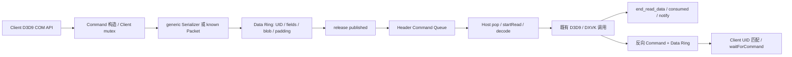

<!-- SPDX-License-Identifier: MIT -->
<!-- Copyright (c) 2026 yeyunyyds. -->
<!-- All newly added implementation code in this fork was generated by OpenAI Codex from prompts and specifications provided by yeyunyyds. -->

# LDB IPC v2：审计、独立原型与阶段门槛

本分支 `codex/ipc-v2-prototype` 保留 LDB。**当前只实现独立传输原型，生产接入模块为零。** 正式 VERSION、累计生产补丁、DXVK、D3D9 Proxy 和 PR6 均未修改。没有可安装的 LDB v2 DLL，没有游戏 FPS 或稳定性结论。

## 1. 证据和审计范围

详细生产源码调查见 [IPC-EFFICIENCY-ARCHITECTURE.md](IPC-EFFICIENCY-ARCHITECTURE.md)。仓库不是完整生产源码树：必须将 NVIDIA upstream `9aa74f8dfad2188efbd0f717c64d9f8fa909787e` 与累计补丁结合。已展开 main 和 PR6，检查项目脚本、配置、测试，以及 Bridge Client/Host API、资源、同步、Shadow/SharedHeap、PageBlock/Retention 等生产调用链；不声称审计整个第三方 DXVK/Tracy/Remix。

冻结对照：

| 对象 | 实际生产版本 | 用途 |
|---|---|---|
| A | v1.2.1 / main `cf49175e8a3c6c2fe45c99aec0680b0d1c864d24`；补丁 SHA-256 `8ce8005da14ea40a4a10d6d7be848be05ce8ac9da25676667fa67820178b87e3` | 正式版真实 transport |
| B | PR6 `14fc5db13d4a9e637fc6b001d06ab5ca3f1eed11`；补丁 SHA-256 `9c0f063939cd14fb3d6571880dfb1e27bdcd8649b746f1f1480c845f4b89e24c` | 最新已验证的 packet 修订 |
| 提取器 | PR6 `8730d84b77c596efdabfad54b7458a8f0aeb01a4` | B 的生产补丁相同，附最新证据/提取器 |
| C | 本分支 `experiments/ipc-v2` | 独立消息流，编译时使用源文件 SHA-256 前 128 bit 匹配 build identity |

旧调查文档描述的是当时可获取的性能报告。PR6 后来补充了最终 Packet 验证结果：x64 Host 64 B 提交 Client 166.91 ns，相对旧 PR 修订减少约 27.48%，相对 main 增加约 37.73%；stream 增加约 9.70%。这些是 PR6 自有微基准，不是本分支 C 的结果，也不是游戏 FPS。

## 2. 现有链路、所有权与同步

Device、Module 各有请求和回复方向。PR6 Data Control 的 published/consumed/fault 与等待标志共用控制缓存行；reserved cursor 位于进程本地 CircularBuffer::m_cursor，Control 的 reserved[] 是预留字段，不是第三个共享原子游标；Header ring 的索引已分离，不能笼统称所有原子均 false sharing。Producer reserved 不等于 Host 可读；published 才可读；consumed 受 active read/pin 约束。optimized dynamic Lock 可能将返回指针保留跨命令直到 Unlock/Destroy，不能按 handler 返回立即回收。

实际 v1/PR6 mapping 均为 `reserved control + CommandQueue metadata/Headers + DataQueue`：v1 reserved 64 bytes，偏移 0/8/16 为 serverDataPos/clientDataExpectedPos/resetRequired；PR6 同一区域为 64-byte `bridge_data::Control`。`m_cmdMemSize = sizeof(Header)*cmdQueueSize + CommandQueue::getExtraMemoryRequirements()`，`m_dataMemSize = memSize-m_cmdMemSize`；Command 从 reserved 之后开始，Data 从 reserved+m_cmdMemSize 开始。mutex、pbCmdInProgress、queue wrapper 和 cached frontier 属于进程本地，NamedSemaphore 是内核对象；不能把 wrapper 内的指针当成 wire layout。

上传常见所有权：应用 Lock 返回 Shadow 或受保护的共享数据指针 → Unlock 将数据编码/复制 → Host 读取共享区域 → backend 内部更新。SharedHeap 是可复用候选，但覆盖同一资源共享 shadow 不能自动保证历史版本不可改写。GPU 完成与 IPC 完成不是同一个边界。

同步边界包含：创建需要 HRESULT/handle 的 API、Get/Query/Readback、Present ack、Reset/DeviceLost、Module handshake/退出。多线程调用依赖既有 Command 锁及局部响应等待关系，不能改成仅锁字段写入而让 Header 顺序混乱。跨 Device/Module 原本的关系需要保留；本原型只保证单 channel 内的严格顺序。

| 热路径成本 | 源码证据与含义 | C 如何处理 / 尚未处理 |
|---|---|---|
| Command ctor/dtor | mutex、UID、异常上下文、in-progress、finish 发布 | 独立 Encoder 本地状态；真实 Proxy adapter 尚未接入 |
| Serializer / reservation | generic 每字段预留；最终 PR6 known Packet 已减少此成本 | 单次有界 reservation，字段推进本地 offset |
| Header / Data 发布 | 两条共享队列要协调 | 同一记录和块可见性入口 |
| 消费进度 | PR6 data consumed 与 Header 消费分别更新 | 每完成块一次确认 |
| 命令锁 | Client mutex 本来提供总序 | 保留由调用者串行化；多线程测试使用同一锁 |
| 同步回复 | 公共队头及 UID 匹配，部分等待 Sleep | 当前使用第二条有序消息流，未实现 Slot |
| 数据复制 | shadow → IPC → backend | reserveBlob 可直接写块；基准仍用相同 memcpy，不冒称减少 backend copy |
| backend 等待 | 真实 D3D9/DXVK/GPU 调用 | 原型不包含，因此无法归因 FPS |

可以复用 Command ID、Host switch/handler、HRESULT 策略、锁、资源 registry、故障诊断入口和构建链。必须更改的集成边界预计包含 `util_bridgecommand.{h,cpp}`、`util_ipcchannel.h`、Serializer、Client 调用处/锁与提交策略、Host `main.cpp/module.cpp` 的读取适配、资源 Lock/Unlock/Readback、SharedHeap ownership、协议握手。**这些生产更改当前没有实施。**

## 3. C 的 ABI、消息格式与快路径

所有共享字段使用固定宽度、little endian、4-byte 记录对齐和 64-byte 控制布局；不共享指针、size_t、STL 容器或 HANDLE。跨进程控制原子只用 lock-free uint32，静态断言大小/偏移；x86 不依赖共享 64-bit 原子。支持范围是 Windows/MSVC 与 Linux/GCC 的 x86 原生共享映射和原子 ABI；不能将 std::atomic 的通用线程保证扩展成任意平台的跨进程保证。配置/Block 对象由 creator 初始化并用 ready 发布，peer 不重新构造。

| 结构 | 大小 / 偏移 | 字段 |
|---|---|---|
| Shared metadata | 0..63 | magic、协议 `0x00020002`、mapping bytes、Config、ready、fault |
| ProducerState | 64..127 | published |
| ConsumerState | 128..191 | completed |
| messages WakeState | 192..255 | armed、epoch |
| credits WakeState | 256..319 | armed、epoch |
| ColdState | 320..383 | 两端 closed / pid；不与 progress 共行 |
| 每块 metadata | 64 bytes | bytes、records、sequence |
| Record | 24 bytes | uint32 bytes；uint16 command/flags；uint32 resource/generation/uid/bodyBytes |
| Body | DWORD 对齐 | uint32 参数；blob = uint32 length + bytes + padding |

Config 同时比较类型 Device/Module、方向、块数/容量、128-bit build identity。启动必须 ready acquire 后验证 magic、version、bytes、整个 Config；不匹配明确拒绝。ad-hoc 未盖章编译只供开发，脚本构建才具备源码标识；不同生产协议不能混用这些 mapping 名称。

块数为 power-of-two，索引 `sequence & (N-1)`，每块 metadata 后紧接连续完整记录。开始一条记录时获得有界容量，不预先 staging：`begin(maximumBodyBytes)` → `scalar/reserveBlob/blob` → `finish`。最终长度可以小于上界。reserveBlob 返回的可写借用仅在该 Encoder 有效且尚未 finish/abort 时有效，不是 D3D9 Lock 指针。Encoder 移动会使旧对象失效，专项测试拒绝其后续写入/发布。未知且无法提供上界的大记录应走独立 pool/分片协议，原型直接拒绝超容量；不跨块留下半记录。

未 finish 的 Encoder 析构只 rollback；超界失败不发布该记录。只有完整记录参与 block.bytes/records。`finish()` 默认立即发布，`finish(false)` 只用于调用者明确管理的实验 batch，容量不足自动先发布旧完整记录。writer 不拥有线程；多线程调用必须在整个 begin→finish→必要回复等待范围内串行化，与现有锁结合时另外审查顺序。

**批处理需要实际语义提交点。** 原型的 batch32 是可控夹具，每 32 条/末尾/RPC 提交，并非生产延迟策略。生产必须先以每 API 返回前提交为正确性基线；跨 API 留未发布块需要明确的延迟上限、已有调用入口上的截止检查和无下一次调用时的及时提交方案。单靠“下一次 API 检查时间”不能给 idle 尾部保证；不增加后台线程的约束下，宁可保留立即发布或仅在单 API 内批量，也不承诺全局 batch32 可直接上线。

## 4. 发布、完成与内存序

生命周期：Free → Producer owns block → local complete records → Published → Host owns/read/execute → Completed → 可复用。published 与 completed 按批次推进，未发布记录不对 Host 可见。Host handler 顺序调用且完整消费 body 后才确认整个块；异常/边界/协议错误不提前归还容量。handler 不得保留 Message 指针，本原型无跨命令 pin。

共享计数 uint32 模 2^32；可观察 outstanding 始终 ≤ N 且 N ≤ 2^20，用 unsigned subtraction 判断窗口。因而不能把它当跨任意历史比较的无限 64-bit 时间戳。逻辑顺序单调，物理计数回绕有专项测试。将来 upload/reply 对超时历史引用用独立 generation 和不提前复用规则，不仅引用该低 32-bit 计数。

Producer 写入 payload/Record/Block metadata，然后 published **seq_cst store**；Reader acquire 读取 published 才能访问；handler 全部读完后 completed **seq_cst store**；Writer acquire 完成后才覆盖。SC 比 release 更强，保留它是为了等待握手的正确性，不声称“只需 release 就足够”。每块的共享更新远少于每字段同步，是否批量更快由测量决定。

等待证明：waiter 先 armed SC store，再对 progress 做 SC recheck；notifier 先 progress SC store，再 armed SC load。SC 全序不允许双方同时遗漏对方：若登记在 progress 之前，notifier 会见 armed；若登记在通知检查之后，recheck 会见 progress。epoch 在最终 predicate 之前读取，Linux futex 比较 epoch，Windows auto-reset event 保存通知。无 lost wake 的论证需要上述顺序，不能随意把进度与登记都改成 relaxed/release-acquire。

正常有数据/有容量不调用 OS wait。冷路径预创建每方向 message/credit 事件，登记后重查条件，假唤醒只重试。方案 A 无自旋；B 最多 128 pause 后同一等待路径。10 ms OS wait 分片用来检查存活/故障，整体操作有显式超时；并非新的常驻线程。Reader idle timeout 不等于损坏；Writer 容量 deadline 触发 sticky fault，之后拒绝 begin/flush。Host/Client 退出通知 closed；异常退出冷路径检测 peer。生产将绑定已验证进程句柄，原型 PID 只用于测试期退出检测，PID reuse 尚需加固。

fault 为当前 channel 的 sticky 状态；原型测试退出会 close 对端并释放映射，但还没有生产 session supervisor。生产接入必须将 Device/Module 四通道的 fatal fault 联动，取消其他等待并沿用既有 DEVICELOST/退出语义，不能依赖另一方向恰好收到命令才发现失败。

命令处理完成只表示 Bridge 不再读该消息块，**不是 GPU fence**。若真实 backend 保留上传指针，必须先复制或显式保留 upload lease，不能套用当前纯消息 handler 的回收约定。

## 5. 后续 upload pool 与 Reply Slot 设计（未实现）

### Upload ownership

Descriptor 候选：uint32 pool/block/generation/offset/length。资源 registry 同时校验 resource id+generation；Record 当前传递 generation，但不替生产 registry 做验证。pool 采用有界 size-class 页/块，Client Free→Writing→PublishedImmutable；Host 取得 lease，最后一次 CPU 访问结束才 Release；Client 收到 release 后才能 reuse+generation。禁止原地覆盖已发布版本，generation wrap 前 retirement；不支持让失效 descriptor 跨 2^32 次重用仍有效。

DISCARD 分配新版本；NOOVERWRITE 验证写入范围/现有内容，并对尚未完成的版本避免覆盖；普通/partial update 在当前内容上构造新版本或复制改动；readonly 保留内容。长期 Lock 的写区独立持有，不 pin 普通消息 ring。指针有效期和内容语义优先决定是否允许直接共享；不适合的资源继续 Shadow + 一次 copy。Destroy 不释放仍被已发布命令/Host lease 引用的版本，最后依赖完成后回收；静态资源只保留当前版本与实际在途版本。

32-bit AV 采用池总上限、按需映射与可复用 mapping 窗口，记录所有已映射 bytes；不能把长期 Lock 映射的块换走。x86 mapping 和 Host private bytes 单独测量。size-class、inline/pool 分流阈值由 Windows 上传基准决定，当前不预设最优。池满有界背压且允许小命令流继续；回收消息块与回收 upload lease 分开确认。

### Reply ownership

固定 Slot 带 generation、状态、HRESULT、小返回值/外部 response descriptor。候选状态 Free→Requested→Completing→Done→ClientConsumed→Free；Host release Done，Client acquire Done。timeout/cancel 后先隔离 Slot，不能直接复用：需 Host 明确 cancel acknowledgement 或旧 epoch 退出，才回收。late/duplicate complete 校验 Slot+generation+状态 CAS。外部返回 payload 在 ClientConsumed 后回收。并发等待使用预创建复用事件/共享通知，避免每次建 kernel object。

当前普通反向消息 stream 的 RPC 结果不能称作 Reply Slot A/B。先拿独立消息流的稳定优势，再单独评估 pool；同步回复的 UID 成本若很低，可以保留旧队列。以上模块延期，而非宣布兼容性已经解决。

## 6. 验证和阶段门槛

1. 审计/协议设计：已完成当前范围。
2. 消息流：独立原型、双向跨进程边界/故障测试；Linux 原生已运行，Windows x86/x64 使用专门 CI。
3. upload pool：等待第 2 阶段性能证据；目前设计，无实现。
4. Reply Slot：单独收益验证后选择；目前设计，无实现。
5. 生产集成：必须在前述模块各自通过后逐步接入。优先即发小命令；每次保留 D3D9 调用顺序与失败语义。
6. Windows/L4D2：需要安装匹配二进制、真实地图/资源生命周期/帧时间验证；当前不可宣称完成。

当前测试另含 Host→Client / Client→Host 的 0 B、64 KiB、512 KiB、2 MiB 完整逐字节往返校验。当前测试涵盖零长度、exact block、溢出、abort、不完整不可见、whole-block reuse、counter wrap、Device/Module、双向、同一锁下多线程、RPC、slow consumer、peer close/exit、超时后拒绝提交、损坏长度、throw handler、OS wait 注入、登记后重查、release→reuse 的 1000 个 map epoch 模型。模型不等于真实地图测试；没有 upload allocator，所以也没有验证 DISCARD/NOOVERWRITE/长期 Lock/Texture/Volume/Readback 的生产语义。

实机回归计划必须分别记录：测试图→MOD 图、MOD 图→测试图、连续切换不同地图、同图重复加载、退出时大量释放后立即创建、上传期间慢 Host，以及长期 Lock 同时提交其他资源。每项收集故障、超时、映射/私有内存和加载帧时间；首次进图正常不代表切图通过。当前仅运行资源代际/顺序模拟，没有真实地图执行。

必须保留的未完成矩阵：实际 D3D9 同步/异步 API、Reset/Present/Device Lost、完整资源种类、Readback、长期 Lock、销毁时在途 upload、生产 Device/Module 顺序、timeout/late/duplicate Reply、版本交叉装配拒绝、x86 AV、后台性能、反复地图切换和 GPU fence/引用。不得因为 transport 数据校验成功就把这些标成通过。

## 7. 复现、构件和回滚

Linux：`python scripts/run_ipc_v2.py --rounds 11`，构建 GCC C++17 /O2，运行跨进程正确性后交替测 C1/C1-old-control/C32/C32-spin/C32-4K/C32-4K-spin。A/B 只在 Windows 运行真实提取代码，Linux 不仿造 A/B。原始结果见 evidence；脚本生成 raw.json/summary.json/BUILD-INFO.json。

Windows：checkout 本分支，再 checkout 冻结的 PR6 到 `.deps/ipc-v2-pr6`；运行 `python scripts/prepare_ipc_v2_baselines.py`，随后 `powershell -File scripts/test_ipc_v2.ps1`。固定 MSVC 14.29 /O2，caller 与 Command 分开 TU、无 LTO，全部 x86 /LARGEADDRESSAWARE。CI artifact 包含原始结果、提取源码及原始生产文件哈希、测试 exe 的 SHA-256、源文件 build identity。这是独立测试程序，**不得复制到游戏目录冒充 d3d9.dll**；无安装步骤，回滚仅删除测试目录/切回原分支。

Actions artifact 解压到相同源码 checkout 的根目录后，可独立运行 `work\ipc-v2\native32.exe --host work\ipc-v2\native64.exe`（x64 Host）或将后者换成 native32.exe（x86 Host）；完整重复基准运行 `python scripts/run_ipc_v2.py --no-build --windows-baselines --rounds 11`。先将 exe 的 Get-FileHash 与 BINARY-SHA256.json 比较，并核对 BUILD-INFO。构件保留 30 天；源脚本和压缩原始证据保存在仓库，可重新构建。

基准同时保留 64 KiB 和 4 KiB 候选，每场景 warmup 后 11 次交替/反向轮转。stream/batch/RPC/mixed/slow/small-arena/idle；0..2 MiB；CPU time、Windows cycles、wall、RPC 分位、映射 bytes、private bytes、理论 memcpy bytes、C 发布次数。当前没有完整性能归因的锁/分配/原子/OS-wait 计数；计数仅 correctness build 的局部测试，不能将推导次数冒称生产实测。Linux 不支持的 cycles/private bytes 不作为有效数据。Win CPU clock 粒度可能限制小样本，只可连同 cycles/wall 分析。idle Host 指标覆盖 500 ms 无数据等待；Client CPU 在提交段结束截取，不含随后等待 Host done 的时间，因此完整 Client/进程空闲 CPU 尚未测量。

C 的计时夹具也逐命令取得/释放 Client mutex，与 A/B 保持相同串行化义务，等待 RPC 时已释放该锁。不同块几何按相同 data-arena **上限**选择，实际映射/有效容量因 power-of-two 与 metadata 不同，原始结果逐项报告，不能称完全相同的有效容量。mapping_bytes 是两条 channel 的请求映射长度，不包含小型夹具 sync mapping，也不是 Windows 全部 VA 碎片/对齐占用或游戏剩余 AV；正式 AV 验收仍未完成。

合并建议以性能报告为准。**生产整体替换默认 BLOCKED**，不能因为单一吞吐项更好就取消完整回归。没有游戏/GPU 环境时应明确保持 gameplay validation 未完成。

控制区冷/热字段分离后 shared header 为 384 bytes。由当前核心机械生成 5889017 对应的旧 320-byte 控制布局作为 C1-old-control；只变布局和相应协议版本，移动所有权、等待重查、编码算法完全相同，并输出生成源码 SHA-256。使用同一 caller、编译器、负载和硬件交替验证；旧布局协议 0x00020001，与新布局 0x00020002 不可混用。关闭/故障登记重查也采用 SC，快路径保留 acquire；C1-old-control 仅供归因，不是生产版本。

基准在计时前由两进程预触全部 mapping；这同时消除旧版首触页成本和 C 初始化 Block metadata 预热的偏差。启动采用共享事件，没有 timed 1 ms 轮询。Client mutex 义务各版本一致；相同 CMD 5 在 frozen A/B 编译时静态断言。

## 8. 如果块方案即发优势不足：下一候选的可实施边界

不强制继续扩展五项机制。先补齐生产 Release 参数和即发＋有限自旋对照；本次 C1 异步只测 event，spin 的 RPC 虽然即发，不能替代全部即发负载。若块方案仍缺乏稳定优势，下一独立候选可以是紧凑 SPSC 字节环：每条完整记录连续写入、API 语义边界发布 committed prefix；Host 缓存已发布边界并顺序解码，环尾用明确 padding/wrap 记录。Producer 本地 reserved offset、共享 published、共享 consumed credit 分开缓存行，计数窗口仍受容量约束。它消除每记录一份 64-byte block metadata，而不是删掉必要内存序。

Host 可以在已取得的连续范围内集中发布 credit，但进入空闲/等待前必须补发；Producer 登记缺空间后必须重新检查，不能让双方都等待尚未发布的 credit。等待/终止采用已验证的同一握手，先保持 SC 发布，后续内存序调整须独立证明。API 返回前的即发基线无需背景提交线程，因此没有跨 API batch 的 idle 尾部缺陷。

原型先只对同一普通记录语义测 A/B/C/D，沿用旧回复或反向 stream，不实现上传/Slot。若即发仍不优于 B，就保留 PR6 或只应用测量明确的局部改善；若稳定优于 B，再做资源/大数据独立所有权。这是可实施的下一步设计，当前没有 D 的实现、测试或收益声明。
